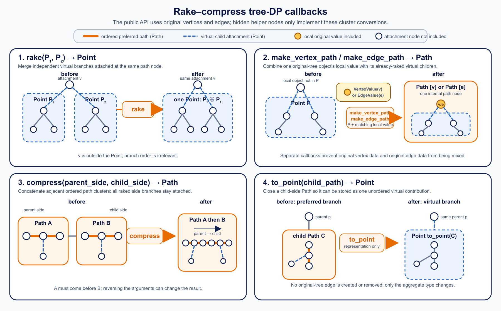

---
data:
  _extendedDependsOn: []
  _extendedRequiredBy: []
  _extendedVerifiedWith:
  - icon: ':heavy_check_mark:'
    path: verify/data_structure/rake_compress_link_cut_tree.test.cpp
    title: verify/data_structure/rake_compress_link_cut_tree.test.cpp
  - icon: ':x:'
    path: verify/data_structure/yosupo_point_set_tree_path_composite_sum.test.cpp
    title: verify/data_structure/yosupo_point_set_tree_path_composite_sum.test.cpp
  _isVerificationFailed: true
  _pathExtension: hpp
  _verificationStatusIcon: ':question:'
  attributes:
    links: []
  bundledCode: "#line 1 \"data_structure/rake_compress_link_cut_tree.hpp\"\n\n\n\n\
    #include <cassert>\n#include <utility>\n#include <vector>\n\nnamespace m1une {\n\
    namespace data_structure {\n\n// Maintains a dynamic forest whose tree DP uses\
    \ two different aggregate types.\n// Point is a commutative group for virtual\
    \ children, while Path is an ordered\n// preferred-path cluster and does not need\
    \ an inverse.\ntemplate <class TreeDPInfo>\nstruct RakeCompressLinkCutTree {\n\
    \    using Point = typename TreeDPInfo::Point;\n    using Path = typename TreeDPInfo::Path;\n\
    \    using Vertex = typename TreeDPInfo::Vertex;\n\n   private:\n    struct Node\
    \ {\n        int left = -1;\n        int right = -1;\n        int parent = -1;\n\
    \        bool rev = false;\n        Vertex value;\n        Point virtual_prod;\n\
    \        Path prod;\n        Path rev_prod;\n\n        explicit Node(const Vertex&\
    \ vertex)\n            : value(vertex),\n              virtual_prod(Point::id()),\n\
    \              prod(TreeDPInfo::add_vertex(virtual_prod, value)),\n          \
    \    rev_prod(prod) {}\n    };\n\n    struct EdgeInfo {\n        int u = -1;\n\
    \        int v = -1;\n        int node = -1;\n        bool alive = false;\n  \
    \  };\n\n    std::vector<Node> _nodes;\n    std::vector<EdgeInfo> _edges;\n  \
    \  std::vector<int> _path_buffer;\n\n    bool is_splay_root(int node) const {\n\
    \        int parent = _nodes[node].parent;\n        return parent == -1 || (_nodes[parent].left\
    \ != node && _nodes[parent].right != node);\n    }\n\n    void update(int node)\
    \ {\n        Node& x = _nodes[node];\n        Path self = TreeDPInfo::add_vertex(x.virtual_prod,\
    \ x.value);\n        x.prod = self;\n        x.rev_prod = self;\n\n        if\
    \ (x.left != -1) {\n            x.prod = TreeDPInfo::compress(_nodes[x.left].prod,\
    \ x.prod);\n            x.rev_prod = TreeDPInfo::compress(x.rev_prod, _nodes[x.left].rev_prod);\n\
    \        }\n        if (x.right != -1) {\n            x.prod = TreeDPInfo::compress(x.prod,\
    \ _nodes[x.right].prod);\n            x.rev_prod = TreeDPInfo::compress(_nodes[x.right].rev_prod,\
    \ x.rev_prod);\n        }\n    }\n\n    void add_virtual_child(int node, int child)\
    \ {\n        if (child == -1) return;\n        Point contribution = TreeDPInfo::add_edge(_nodes[child].prod);\n\
    \        _nodes[node].virtual_prod = TreeDPInfo::rake(_nodes[node].virtual_prod,\
    \ contribution);\n    }\n\n    void remove_virtual_child(int node, int child)\
    \ {\n        if (child == -1) return;\n        Point contribution = TreeDPInfo::add_edge(_nodes[child].prod);\n\
    \        _nodes[node].virtual_prod = TreeDPInfo::rake(_nodes[node].virtual_prod,\
    \ contribution.inv());\n    }\n\n    void apply_reverse(int node) {\n        if\
    \ (node == -1) return;\n        Node& x = _nodes[node];\n        std::swap(x.left,\
    \ x.right);\n        std::swap(x.prod, x.rev_prod);\n        x.rev = !x.rev;\n\
    \    }\n\n    void push(int node) {\n        if (node == -1 || !_nodes[node].rev)\
    \ return;\n        apply_reverse(_nodes[node].left);\n        apply_reverse(_nodes[node].right);\n\
    \        _nodes[node].rev = false;\n    }\n\n    void push_to(int node) {\n  \
    \      _path_buffer.clear();\n        int cur = node;\n        _path_buffer.push_back(cur);\n\
    \        while (!is_splay_root(cur)) {\n            cur = _nodes[cur].parent;\n\
    \            _path_buffer.push_back(cur);\n        }\n        for (int i = int(_path_buffer.size())\
    \ - 1; i >= 0; i--) push(_path_buffer[i]);\n    }\n\n    void rotate(int node)\
    \ {\n        int parent = _nodes[node].parent;\n        int grand = _nodes[parent].parent;\n\
    \        bool is_right = _nodes[parent].right == node;\n        int middle = is_right\
    \ ? _nodes[node].left : _nodes[node].right;\n\n        if (!is_splay_root(parent))\
    \ {\n            if (_nodes[grand].left == parent) {\n                _nodes[grand].left\
    \ = node;\n            } else {\n                _nodes[grand].right = node;\n\
    \            }\n        }\n        _nodes[node].parent = grand;\n\n        if\
    \ (is_right) {\n            _nodes[node].left = parent;\n            _nodes[parent].right\
    \ = middle;\n        } else {\n            _nodes[node].right = parent;\n    \
    \        _nodes[parent].left = middle;\n        }\n        if (middle != -1) _nodes[middle].parent\
    \ = parent;\n        _nodes[parent].parent = node;\n\n        update(parent);\n\
    \        update(node);\n    }\n\n    void splay(int node) {\n        push_to(node);\n\
    \        while (!is_splay_root(node)) {\n            int parent = _nodes[node].parent;\n\
    \            int grand = _nodes[parent].parent;\n            if (!is_splay_root(parent))\
    \ {\n                bool zig_zig = (_nodes[parent].left == node) == (_nodes[grand].left\
    \ == parent);\n                rotate(zig_zig ? parent : node);\n            }\n\
    \            rotate(node);\n        }\n    }\n\n    int access(int node) {\n \
    \       int last = -1;\n        for (int cur = node; cur != -1; cur = _nodes[cur].parent)\
    \ {\n            splay(cur);\n            add_virtual_child(cur, _nodes[cur].right);\n\
    \            remove_virtual_child(cur, last);\n            _nodes[cur].right =\
    \ last;\n            if (last != -1) _nodes[last].parent = cur;\n            update(cur);\n\
    \            last = cur;\n        }\n        splay(node);\n        return last;\n\
    \    }\n\n    void check_vertex(int v) const {\n        assert(0 <= v && v < int(_nodes.size()));\n\
    \    }\n\n    void check_edge(int edge_id) const {\n        assert(0 <= edge_id\
    \ && edge_id < int(_edges.size()));\n    }\n\n   public:\n    RakeCompressLinkCutTree()\
    \ = default;\n\n    explicit RakeCompressLinkCutTree(const std::vector<Vertex>&\
    \ values) {\n        _nodes.reserve(values.size());\n        for (const Vertex&\
    \ value : values) add_vertex(value);\n    }\n\n    int size() const {\n      \
    \  return int(_nodes.size());\n    }\n\n    bool empty() const {\n        return\
    \ _nodes.empty();\n    }\n\n    int add_vertex(const Vertex& vertex) {\n     \
    \   _nodes.emplace_back(vertex);\n        return int(_nodes.size()) - 1;\n   \
    \ }\n\n    int edge_count() const {\n        return int(_edges.size());\n    }\n\
    \n    bool edge_alive(int edge_id) const {\n        check_edge(edge_id);\n   \
    \     return _edges[edge_id].alive;\n    }\n\n    int edge_node(int edge_id) const\
    \ {\n        check_edge(edge_id);\n        return _edges[edge_id].node;\n    }\n\
    \n    std::pair<int, int> edge_endpoints(int edge_id) const {\n        check_edge(edge_id);\n\
    \        return {_edges[edge_id].u, _edges[edge_id].v};\n    }\n\n    const Vertex&\
    \ get(int v) const {\n        check_vertex(v);\n        return _nodes[v].value;\n\
    \    }\n\n    const Vertex& operator[](int v) const {\n        return get(v);\n\
    \    }\n\n    void set(int v, const Vertex& vertex) {\n        check_vertex(v);\n\
    \        access(v);\n        _nodes[v].value = vertex;\n        update(v);\n \
    \   }\n\n    // Makes v the represented root of its component.\n    void evert(int\
    \ v) {\n        check_vertex(v);\n        access(v);\n        apply_reverse(v);\n\
    \    }\n\n    void reroot(int v) {\n        evert(v);\n    }\n\n    int component_root(int\
    \ v) {\n        check_vertex(v);\n        access(v);\n        int cur = v;\n \
    \       push(cur);\n        while (_nodes[cur].left != -1) {\n            cur\
    \ = _nodes[cur].left;\n            push(cur);\n        }\n        splay(cur);\n\
    \        return cur;\n    }\n\n    int root(int v) {\n        return component_root(v);\n\
    \    }\n\n    bool connected(int u, int v) {\n        check_vertex(u);\n     \
    \   check_vertex(v);\n        if (u == v) return true;\n        return component_root(u)\
    \ == component_root(v);\n    }\n\n    bool same(int u, int v) {\n        return\
    \ connected(u, v);\n    }\n\n    // Links two different components and returns\
    \ whether an edge was added.\n    bool link(int u, int v) {\n        check_vertex(u);\n\
    \        check_vertex(v);\n        if (u == v) return false;\n        evert(u);\n\
    \        if (component_root(v) == u) return false;\n        access(v);\n     \
    \   _nodes[u].parent = v;\n        add_virtual_child(v, u);\n        update(v);\n\
    \        return true;\n    }\n\n    bool link_parent(int child, int parent) {\n\
    \        return link(child, parent);\n    }\n\n    int link_edge(int u, int v,\
    \ const Vertex& edge_vertex) {\n        check_vertex(u);\n        check_vertex(v);\n\
    \        if (u == v || connected(u, v)) return -1;\n        int edge_id = int(_edges.size());\n\
    \        int node = add_vertex(edge_vertex);\n        _edges.push_back(EdgeInfo{u,\
    \ v, node, true});\n        bool ok1 = link(u, node);\n        bool ok2 = link(node,\
    \ v);\n        assert(ok1 && ok2);\n        return edge_id;\n    }\n\n    // Cuts\
    \ the represented-tree edge (u, v), if it exists.\n    bool cut(int u, int v)\
    \ {\n        check_vertex(u);\n        check_vertex(v);\n        if (u == v) return\
    \ false;\n        evert(u);\n        access(v);\n        if (_nodes[v].left !=\
    \ u || _nodes[u].right != -1) return false;\n        _nodes[v].left = -1;\n  \
    \      _nodes[u].parent = -1;\n        update(v);\n        return true;\n    }\n\
    \n    // Cuts the parent edge of v in the current represented-root orientation.\n\
    \    bool cut_parent(int v) {\n        check_vertex(v);\n        access(v);\n\
    \        int left = _nodes[v].left;\n        if (left == -1) return false;\n \
    \       _nodes[v].left = -1;\n        _nodes[left].parent = -1;\n        update(v);\n\
    \        return true;\n    }\n\n    bool cut_edge(int edge_id) {\n        check_edge(edge_id);\n\
    \        EdgeInfo& edge = _edges[edge_id];\n        if (!edge.alive) return false;\n\
    \        bool ok1 = cut(edge.u, edge.node);\n        bool ok2 = cut(edge.node,\
    \ edge.v);\n        if (ok1 && ok2) edge.alive = false;\n        return ok1 &&\
    \ ok2;\n    }\n\n    const Vertex& get_edge(int edge_id) const {\n        return\
    \ get(edge_node(edge_id));\n    }\n\n    void set_edge(int edge_id, const Vertex&\
    \ edge_vertex) {\n        set(edge_node(edge_id), edge_vertex);\n    }\n\n   \
    \ // Reroots the represented tree at v and returns its whole-tree cluster.\n \
    \   Path component_prod(int v) {\n        evert(v);\n        return _nodes[v].prod;\n\
    \    }\n\n    Path query_component(int v) {\n        return component_prod(v);\n\
    \    }\n};\n\n}  // namespace data_structure\n}  // namespace m1une\n\n\n"
  code: "#ifndef M1UNE_RAKE_COMPRESS_LINK_CUT_TREE_HPP\n#define M1UNE_RAKE_COMPRESS_LINK_CUT_TREE_HPP\
    \ 1\n\n#include <cassert>\n#include <utility>\n#include <vector>\n\nnamespace\
    \ m1une {\nnamespace data_structure {\n\n// Maintains a dynamic forest whose tree\
    \ DP uses two different aggregate types.\n// Point is a commutative group for\
    \ virtual children, while Path is an ordered\n// preferred-path cluster and does\
    \ not need an inverse.\ntemplate <class TreeDPInfo>\nstruct RakeCompressLinkCutTree\
    \ {\n    using Point = typename TreeDPInfo::Point;\n    using Path = typename\
    \ TreeDPInfo::Path;\n    using Vertex = typename TreeDPInfo::Vertex;\n\n   private:\n\
    \    struct Node {\n        int left = -1;\n        int right = -1;\n        int\
    \ parent = -1;\n        bool rev = false;\n        Vertex value;\n        Point\
    \ virtual_prod;\n        Path prod;\n        Path rev_prod;\n\n        explicit\
    \ Node(const Vertex& vertex)\n            : value(vertex),\n              virtual_prod(Point::id()),\n\
    \              prod(TreeDPInfo::add_vertex(virtual_prod, value)),\n          \
    \    rev_prod(prod) {}\n    };\n\n    struct EdgeInfo {\n        int u = -1;\n\
    \        int v = -1;\n        int node = -1;\n        bool alive = false;\n  \
    \  };\n\n    std::vector<Node> _nodes;\n    std::vector<EdgeInfo> _edges;\n  \
    \  std::vector<int> _path_buffer;\n\n    bool is_splay_root(int node) const {\n\
    \        int parent = _nodes[node].parent;\n        return parent == -1 || (_nodes[parent].left\
    \ != node && _nodes[parent].right != node);\n    }\n\n    void update(int node)\
    \ {\n        Node& x = _nodes[node];\n        Path self = TreeDPInfo::add_vertex(x.virtual_prod,\
    \ x.value);\n        x.prod = self;\n        x.rev_prod = self;\n\n        if\
    \ (x.left != -1) {\n            x.prod = TreeDPInfo::compress(_nodes[x.left].prod,\
    \ x.prod);\n            x.rev_prod = TreeDPInfo::compress(x.rev_prod, _nodes[x.left].rev_prod);\n\
    \        }\n        if (x.right != -1) {\n            x.prod = TreeDPInfo::compress(x.prod,\
    \ _nodes[x.right].prod);\n            x.rev_prod = TreeDPInfo::compress(_nodes[x.right].rev_prod,\
    \ x.rev_prod);\n        }\n    }\n\n    void add_virtual_child(int node, int child)\
    \ {\n        if (child == -1) return;\n        Point contribution = TreeDPInfo::add_edge(_nodes[child].prod);\n\
    \        _nodes[node].virtual_prod = TreeDPInfo::rake(_nodes[node].virtual_prod,\
    \ contribution);\n    }\n\n    void remove_virtual_child(int node, int child)\
    \ {\n        if (child == -1) return;\n        Point contribution = TreeDPInfo::add_edge(_nodes[child].prod);\n\
    \        _nodes[node].virtual_prod = TreeDPInfo::rake(_nodes[node].virtual_prod,\
    \ contribution.inv());\n    }\n\n    void apply_reverse(int node) {\n        if\
    \ (node == -1) return;\n        Node& x = _nodes[node];\n        std::swap(x.left,\
    \ x.right);\n        std::swap(x.prod, x.rev_prod);\n        x.rev = !x.rev;\n\
    \    }\n\n    void push(int node) {\n        if (node == -1 || !_nodes[node].rev)\
    \ return;\n        apply_reverse(_nodes[node].left);\n        apply_reverse(_nodes[node].right);\n\
    \        _nodes[node].rev = false;\n    }\n\n    void push_to(int node) {\n  \
    \      _path_buffer.clear();\n        int cur = node;\n        _path_buffer.push_back(cur);\n\
    \        while (!is_splay_root(cur)) {\n            cur = _nodes[cur].parent;\n\
    \            _path_buffer.push_back(cur);\n        }\n        for (int i = int(_path_buffer.size())\
    \ - 1; i >= 0; i--) push(_path_buffer[i]);\n    }\n\n    void rotate(int node)\
    \ {\n        int parent = _nodes[node].parent;\n        int grand = _nodes[parent].parent;\n\
    \        bool is_right = _nodes[parent].right == node;\n        int middle = is_right\
    \ ? _nodes[node].left : _nodes[node].right;\n\n        if (!is_splay_root(parent))\
    \ {\n            if (_nodes[grand].left == parent) {\n                _nodes[grand].left\
    \ = node;\n            } else {\n                _nodes[grand].right = node;\n\
    \            }\n        }\n        _nodes[node].parent = grand;\n\n        if\
    \ (is_right) {\n            _nodes[node].left = parent;\n            _nodes[parent].right\
    \ = middle;\n        } else {\n            _nodes[node].right = parent;\n    \
    \        _nodes[parent].left = middle;\n        }\n        if (middle != -1) _nodes[middle].parent\
    \ = parent;\n        _nodes[parent].parent = node;\n\n        update(parent);\n\
    \        update(node);\n    }\n\n    void splay(int node) {\n        push_to(node);\n\
    \        while (!is_splay_root(node)) {\n            int parent = _nodes[node].parent;\n\
    \            int grand = _nodes[parent].parent;\n            if (!is_splay_root(parent))\
    \ {\n                bool zig_zig = (_nodes[parent].left == node) == (_nodes[grand].left\
    \ == parent);\n                rotate(zig_zig ? parent : node);\n            }\n\
    \            rotate(node);\n        }\n    }\n\n    int access(int node) {\n \
    \       int last = -1;\n        for (int cur = node; cur != -1; cur = _nodes[cur].parent)\
    \ {\n            splay(cur);\n            add_virtual_child(cur, _nodes[cur].right);\n\
    \            remove_virtual_child(cur, last);\n            _nodes[cur].right =\
    \ last;\n            if (last != -1) _nodes[last].parent = cur;\n            update(cur);\n\
    \            last = cur;\n        }\n        splay(node);\n        return last;\n\
    \    }\n\n    void check_vertex(int v) const {\n        assert(0 <= v && v < int(_nodes.size()));\n\
    \    }\n\n    void check_edge(int edge_id) const {\n        assert(0 <= edge_id\
    \ && edge_id < int(_edges.size()));\n    }\n\n   public:\n    RakeCompressLinkCutTree()\
    \ = default;\n\n    explicit RakeCompressLinkCutTree(const std::vector<Vertex>&\
    \ values) {\n        _nodes.reserve(values.size());\n        for (const Vertex&\
    \ value : values) add_vertex(value);\n    }\n\n    int size() const {\n      \
    \  return int(_nodes.size());\n    }\n\n    bool empty() const {\n        return\
    \ _nodes.empty();\n    }\n\n    int add_vertex(const Vertex& vertex) {\n     \
    \   _nodes.emplace_back(vertex);\n        return int(_nodes.size()) - 1;\n   \
    \ }\n\n    int edge_count() const {\n        return int(_edges.size());\n    }\n\
    \n    bool edge_alive(int edge_id) const {\n        check_edge(edge_id);\n   \
    \     return _edges[edge_id].alive;\n    }\n\n    int edge_node(int edge_id) const\
    \ {\n        check_edge(edge_id);\n        return _edges[edge_id].node;\n    }\n\
    \n    std::pair<int, int> edge_endpoints(int edge_id) const {\n        check_edge(edge_id);\n\
    \        return {_edges[edge_id].u, _edges[edge_id].v};\n    }\n\n    const Vertex&\
    \ get(int v) const {\n        check_vertex(v);\n        return _nodes[v].value;\n\
    \    }\n\n    const Vertex& operator[](int v) const {\n        return get(v);\n\
    \    }\n\n    void set(int v, const Vertex& vertex) {\n        check_vertex(v);\n\
    \        access(v);\n        _nodes[v].value = vertex;\n        update(v);\n \
    \   }\n\n    // Makes v the represented root of its component.\n    void evert(int\
    \ v) {\n        check_vertex(v);\n        access(v);\n        apply_reverse(v);\n\
    \    }\n\n    void reroot(int v) {\n        evert(v);\n    }\n\n    int component_root(int\
    \ v) {\n        check_vertex(v);\n        access(v);\n        int cur = v;\n \
    \       push(cur);\n        while (_nodes[cur].left != -1) {\n            cur\
    \ = _nodes[cur].left;\n            push(cur);\n        }\n        splay(cur);\n\
    \        return cur;\n    }\n\n    int root(int v) {\n        return component_root(v);\n\
    \    }\n\n    bool connected(int u, int v) {\n        check_vertex(u);\n     \
    \   check_vertex(v);\n        if (u == v) return true;\n        return component_root(u)\
    \ == component_root(v);\n    }\n\n    bool same(int u, int v) {\n        return\
    \ connected(u, v);\n    }\n\n    // Links two different components and returns\
    \ whether an edge was added.\n    bool link(int u, int v) {\n        check_vertex(u);\n\
    \        check_vertex(v);\n        if (u == v) return false;\n        evert(u);\n\
    \        if (component_root(v) == u) return false;\n        access(v);\n     \
    \   _nodes[u].parent = v;\n        add_virtual_child(v, u);\n        update(v);\n\
    \        return true;\n    }\n\n    bool link_parent(int child, int parent) {\n\
    \        return link(child, parent);\n    }\n\n    int link_edge(int u, int v,\
    \ const Vertex& edge_vertex) {\n        check_vertex(u);\n        check_vertex(v);\n\
    \        if (u == v || connected(u, v)) return -1;\n        int edge_id = int(_edges.size());\n\
    \        int node = add_vertex(edge_vertex);\n        _edges.push_back(EdgeInfo{u,\
    \ v, node, true});\n        bool ok1 = link(u, node);\n        bool ok2 = link(node,\
    \ v);\n        assert(ok1 && ok2);\n        return edge_id;\n    }\n\n    // Cuts\
    \ the represented-tree edge (u, v), if it exists.\n    bool cut(int u, int v)\
    \ {\n        check_vertex(u);\n        check_vertex(v);\n        if (u == v) return\
    \ false;\n        evert(u);\n        access(v);\n        if (_nodes[v].left !=\
    \ u || _nodes[u].right != -1) return false;\n        _nodes[v].left = -1;\n  \
    \      _nodes[u].parent = -1;\n        update(v);\n        return true;\n    }\n\
    \n    // Cuts the parent edge of v in the current represented-root orientation.\n\
    \    bool cut_parent(int v) {\n        check_vertex(v);\n        access(v);\n\
    \        int left = _nodes[v].left;\n        if (left == -1) return false;\n \
    \       _nodes[v].left = -1;\n        _nodes[left].parent = -1;\n        update(v);\n\
    \        return true;\n    }\n\n    bool cut_edge(int edge_id) {\n        check_edge(edge_id);\n\
    \        EdgeInfo& edge = _edges[edge_id];\n        if (!edge.alive) return false;\n\
    \        bool ok1 = cut(edge.u, edge.node);\n        bool ok2 = cut(edge.node,\
    \ edge.v);\n        if (ok1 && ok2) edge.alive = false;\n        return ok1 &&\
    \ ok2;\n    }\n\n    const Vertex& get_edge(int edge_id) const {\n        return\
    \ get(edge_node(edge_id));\n    }\n\n    void set_edge(int edge_id, const Vertex&\
    \ edge_vertex) {\n        set(edge_node(edge_id), edge_vertex);\n    }\n\n   \
    \ // Reroots the represented tree at v and returns its whole-tree cluster.\n \
    \   Path component_prod(int v) {\n        evert(v);\n        return _nodes[v].prod;\n\
    \    }\n\n    Path query_component(int v) {\n        return component_prod(v);\n\
    \    }\n};\n\n}  // namespace data_structure\n}  // namespace m1une\n\n#endif\
    \  // M1UNE_RAKE_COMPRESS_LINK_CUT_TREE_HPP\n"
  dependsOn: []
  isVerificationFile: false
  path: data_structure/rake_compress_link_cut_tree.hpp
  requiredBy: []
  timestamp: '2026-06-19 15:58:28+09:00'
  verificationStatus: LIBRARY_SOME_WA
  verifiedWith:
  - verify/data_structure/rake_compress_link_cut_tree.test.cpp
  - verify/data_structure/yosupo_point_set_tree_path_composite_sum.test.cpp
documentation_of: data_structure/rake_compress_link_cut_tree.hpp
layout: document
title: Rake-Compress Link-Cut Tree
---

## Overview

`m1une::data_structure::RakeCompressLinkCutTree<TreeDPInfo>` maintains a
dynamic forest together with a tree DP. It separates the two aggregates needed
by subtree-aware link-cut trees:

* `Point` is a commutative group used to rake independent virtual children.
* `Path` is an ordered cluster used to compress a preferred path.

Only `Point` needs an inverse. In particular, affine functions on a path do not
need to be invertible, and `Path` does not need an identity or inverse.

All dynamic-forest operations take amortized $O(\log N)$ time, where $N$ is
the number of link-cut-tree nodes, including helper edge nodes. The structure
uses $O(N)$ space.

## Tree DP Interface

`TreeDPInfo` provides three types:

```cpp
using Point = ...;
using Path = ...;
using Vertex = ...;
```

These types describe three different levels of the tree DP:



The three panels show the core conversions: `add_vertex` combines local
`Vertex` data with raked virtual-child `Point` data, `compress` concatenates
ordered `Path` clusters, and `add_edge` converts an off-path branch from
`Path` form into `Point` form so that it can be combined with the other virtual
children.

### `Vertex`

`Vertex` is the local data stored at one link-cut-tree node. It is not an
aggregate. For example, it may store the value of an original tree vertex, or
the affine function of an original edge when that edge is represented by a
helper node.

`set(v, vertex)` replaces this local data. `add_vertex(point, vertex)` combines
it with the already-aggregated virtual children to create a one-node `Path`
cluster.

### `Point`

`Point` represents zero or more independent child-side clusters attached at
the same path node. These are the virtual children: represented-tree edges
which are not currently part of the preferred path.

Their order has no meaning, so `rake` must be associative and commutative.
`Point::id()` represents no virtual children. `Point::inv()` lets `access`
remove a child contribution when that child enters the preferred path.

Conceptually, a node maintains:

```cpp
Point virtual_children = Point::id();
virtual_children = rake(virtual_children, add_edge(child_path));
```

`Point` does not include the local `Vertex` at the attachment node.

### `Path`

`Path` represents an ordered, nonempty preferred-path cluster. It contains the
nodes on that path together with all `Point` contributions raked into those
nodes. Its two ends have an order: the parent-side end comes before the
child-side end in the current represented-root orientation.

`compress(parent_side, child_side)` concatenates two adjacent path clusters in
that order. It must be associative, but does not need to be commutative.
Reversing a represented path may change the aggregate, so each link-cut-tree
node maintains both the forward and reverse `Path` products.

When a branch is part of the preferred path, its summary is a `Path` because
its order matters. When that branch becomes a virtual child, it must be stored
in the parent's unordered `Point` aggregate instead. `add_edge(path)` performs
this conversion:

```cpp
Point branch = add_edge(child_path);
virtual_children = rake(virtual_children, branch);
```

Despite its name, `add_edge` does not modify the represented tree or create an
edge. `link` and `link_edge` do that. The name follows the rake-compress
operation that closes a path cluster at its parent-side boundary.

A `Path` needs neither an identity nor an inverse.

At a link-cut-tree node, the aggregate is formed schematically as:

```cpp
Path self = add_vertex(virtual_children, vertex);
Path whole = self;
if (left_path_exists) whole = compress(left_path, whole);
if (right_path_exists) whole = compress(whole, right_path);
```

`Point` provides:

```cpp
static Point id();
Point inv() const;
```

`TreeDPInfo` provides:

```cpp
static Path add_vertex(const Point& virtual_children, const Vertex& vertex);
static Point add_edge(const Path& path);
static Point rake(const Point& a, const Point& b);
static Path compress(const Path& parent_side, const Path& child_side);
```

The operations have the following meanings:

* `rake(a, b)` merges independent virtual-subtree contributions. It must be
  associative and commutative.
* `compress(p, c)` joins an upper parent-side path cluster with a lower
  child-side path cluster. It must be associative, but need not be commutative.
* `add_vertex(point, vertex)` combines one node with its virtual children.
* `add_edge(path)` converts an ordered branch summary into the unordered
  `Point` value that can be raked with the other virtual children.

The inverse of `add_edge(path)` is used only when `access` changes a preferred
child back into a virtual child or vice versa.

## Main Methods

| Method | Description | Time |
| --- | --- | --- |
| `int add_vertex(vertex)` | Adds an isolated node and returns its index. | Amortized $O(1)$ |
| `const Vertex& get(v)` | Returns the information stored at node `v`. | $O(1)$ |
| `void set(v, vertex)` | Replaces the information at node `v`. | Amortized $O(\log N)$ |
| `void evert(v)` | Makes `v` the represented root. | Amortized $O(\log N)$ |
| `bool connected(u, v)` | Tests whether two nodes are in the same component. | Amortized $O(\log N)$ |
| `bool link(u, v)` | Links two different components. | Amortized $O(\log N)$ |
| `bool cut(u, v)` | Cuts the represented-tree edge between adjacent nodes. | Amortized $O(\log N)$ |
| `bool cut_parent(v)` | Cuts the parent edge of `v` in the current root orientation. | Amortized $O(\log N)$ |
| `Path component_prod(v)` | Reroots at `v` and returns the whole-component cluster. | Amortized $O(\log N)$ |

`query_component(v)` is an alias for `component_prod(v)`.

## Edge Values

`link_edge(u, v, vertex)` creates a helper node between `u` and `v`, stores
`vertex` on it, and returns an edge id. The helper methods `edge_node`,
`edge_endpoints`, `get_edge`, `set_edge`, and `cut_edge` use that id.

`link_edge`, `set_edge`, and `cut_edge` take amortized $O(\log N)$ time.
`edge_node`, `edge_endpoints`, `get_edge`, `edge_count`, and `edge_alive` take
$O(1)$ time.

This is useful when original vertices and original edges use different cases of
the same `Vertex` type. The Point Set Tree Path Composite Sum verification uses
vertex nodes for point values and helper edge nodes for affine functions.

## Example

The following DP stores an integer on every original vertex and an affine
function $f(t) = at + b$ on every original edge. The query returns the sum of
all vertex values after each value is transported toward the chosen root by the
edge functions on its path.

```cpp
#include <iostream>

#include "data_structure/rake_compress_link_cut_tree.hpp"

struct AffineTreeSum {
    struct Point {
        long long sum;
        long long count;

        static Point id() {
            return Point{0, 0};
        }

        Point inv() const {
            return Point{-sum, -count};
        }
    };

    struct Path {
        long long a;
        long long b;
        long long sum;
        long long count;
    };

    struct Vertex {
        bool is_vertex;
        long long a;
        long long b;
    };

    static Path add_vertex(const Point& children, const Vertex& vertex) {
        if (vertex.is_vertex) {
            return Path{1, 0, children.sum + vertex.a, children.count + 1};
        }
        return Path{
            vertex.a,
            vertex.b,
            children.sum * vertex.a + children.count * vertex.b,
            children.count
        };
    }

    static Point add_edge(const Path& path) {
        return Point{path.sum, path.count};
    }

    static Point rake(const Point& x, const Point& y) {
        return Point{x.sum + y.sum, x.count + y.count};
    }

    static Path compress(const Path& parent, const Path& child) {
        return Path{
            parent.a * child.a,
            parent.a * child.b + parent.b,
            parent.sum + parent.a * child.sum + parent.b * child.count,
            parent.count + child.count
        };
    }
};

int main() {
    using LCT =
        m1une::data_structure::RakeCompressLinkCutTree<AffineTreeSum>;

    LCT lct;
    int u = lct.add_vertex(AffineTreeSum::Vertex{true, 2, 0});
    int v = lct.add_vertex(AffineTreeSum::Vertex{true, 3, 0});
    int w = lct.add_vertex(AffineTreeSum::Vertex{true, 5, 0});

    // u --(t -> 2t + 1)--> v --(t -> 3t)--> w
    int uv = lct.link_edge(u, v, AffineTreeSum::Vertex{false, 2, 1});
    lct.link_edge(v, w, AffineTreeSum::Vertex{false, 3, 0});

    long long rooted_at_u = lct.component_prod(u).sum;
    long long rooted_at_w = lct.component_prod(w).sum;
    std::cout << rooted_at_u << '\n';  // 40
    std::cout << rooted_at_w << '\n';  // 29

    lct.set(v, AffineTreeSum::Vertex{true, 7, 0});
    lct.set_edge(uv, AffineTreeSum::Vertex{false, 0, 4});
}
```

`compress(parent, child)` is ordered: reversing its arguments generally
changes the result. The affine coefficient may be zero because only `Point`
requires an inverse.

## Notes

`component_prod(v)` changes the represented root to `v`. Its returned `Path`
contains the whole component, including all virtual branches attached to the
preferred path exposed by rerooting.

The structure assumes that the supplied rake/compress operations describe a
valid associative tree DP. It does not require affine coefficients or other
path transitions to be invertible.
