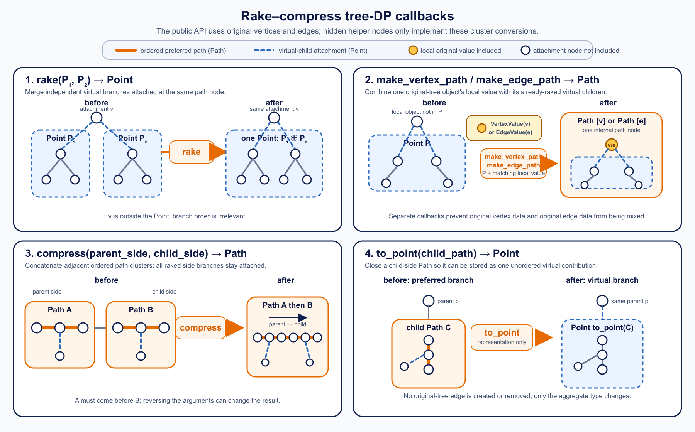

## Overview

`m1une::data_structure::RakeCompressLinkCutTree<TreeDPInfo>` maintains a
dynamic forest together with a tree DP. It separates the two aggregates needed
by subtree-aware link-cut trees:

* `Point` is a commutative group used to rake independent virtual children.
* `Path` is an ordered cluster used to compress a preferred path.

Only `Point` needs an inverse. In particular, affine functions on a path do not
need to be invertible, and `Path` does not need an identity or inverse.

All dynamic-forest operations take amortized $O(\log N)$ time. Internally, each
original edge is represented by a hidden helper node, but helper-node ids and
operations are not exposed by the public API.

## Two Interface Layers

The public interface describes only the original forest:

* `add_vertex`, `get_vertex`, and `set_vertex` use original vertex ids.
* `add_edge`, `get_edge`, `set_edge`, and `cut_edge` use original edge ids.
* `reroot`, `connected`, and `component_prod` accept original vertex ids.

The class names these roles `VertexId` and `EdgeId` (both aliases of `int` for
contest ergonomics). Internal link-cut-tree node ids are private and have no
public alias or accessor.

`TreeDPInfo` also keeps original vertex data and original edge data separate.
This removes the need for a tagged union such as `NodeValue{is_vertex, ...}`.

## Tree DP Interface

`TreeDPInfo` provides four types:

```cpp
using Point = ...;
using Path = ...;
using VertexValue = ...;
using EdgeValue = ...;
```

These types separate local original-tree data from the two aggregate levels:



The four panels show the operations on explicit before-and-after tree
drawings. `rake` merges independent virtual branches at the same attachment
node, `make_vertex_path` or `make_edge_path` inserts the matching original-tree
value, `compress` concatenates adjacent ordered `Path` clusters, and
`to_point` converts a child branch from `Path` form into a `Point`
contribution. These callbacks change the aggregate representation, not the
original-tree topology.

### `VertexValue` and `EdgeValue`

`VertexValue` is the local data stored on an original vertex. `EdgeValue` is
the local data stored on an original edge. Neither is an aggregate.

`make_vertex_path(point, vertex_value)` combines an original vertex with its
already-aggregated virtual children. `make_edge_path(point, edge_value)` does
the analogous operation for an original edge's hidden helper node.

### `Point`

`Point` represents zero or more independent child-side clusters attached at
the same path node. These are the virtual children: represented-tree edges
which are not currently part of the preferred path.

Their order has no meaning, so `rake` must be associative and commutative.
`Point::id()` represents no virtual children. `Point::inv()` lets `access`
remove a child contribution when that child enters the preferred path.

Conceptually, a node maintains:

```cpp
Point virtual_children = Point::id();
virtual_children = rake(virtual_children, to_point(child_path));
```

`Point` does not include the local original-tree object at the attachment node.

### `Path`

`Path` represents an ordered, nonempty preferred-path cluster. It contains the
nodes on that path together with all `Point` contributions raked into those
nodes. Its two ends have an order: the parent-side end comes before the
child-side end in the current represented-root orientation.

`compress(parent_side, child_side)` concatenates two adjacent path clusters in
that order. It must be associative, but does not need to be commutative.
Reversing a represented path may change the aggregate, so each link-cut-tree
node maintains both the forward and reverse `Path` products.

When a branch is part of the preferred path, its summary is a `Path` because
its order matters. When that branch becomes a virtual child, it must be stored
in the parent's unordered `Point` aggregate instead. `to_point(path)` performs
this conversion:

```cpp
Point branch = to_point(child_path);
virtual_children = rake(virtual_children, branch);
```

`to_point` does not modify the original forest. It only changes the DP
representation of an existing child branch.

A `Path` needs neither an identity nor an inverse.

At a link-cut-tree node, the aggregate is formed schematically as:

```cpp
Path self = make_vertex_path(virtual_children, vertex_value);
// or make_edge_path(virtual_children, edge_value) at a hidden edge node
Path whole = self;
if (left_path_exists) whole = compress(left_path, whole);
if (right_path_exists) whole = compress(whole, right_path);
```

`Point` provides:

```cpp
static Point id();
Point inv() const;
```

`TreeDPInfo` provides:

```cpp
static Path make_vertex_path(
    const Point& virtual_children,
    const VertexValue& vertex_value
);
static Path make_edge_path(
    const Point& virtual_children,
    const EdgeValue& edge_value
);
static Point to_point(const Path& path);
static Point rake(const Point& a, const Point& b);
static Path compress(const Path& parent_side, const Path& child_side);
```

The operations have the following meanings:

* `rake(a, b)` merges independent virtual-subtree contributions. It must be
  associative and commutative.
* `compress(p, c)` joins an upper parent-side path cluster with a lower
  child-side path cluster. It must be associative, but need not be commutative.
* `make_vertex_path(point, value)` adds one original vertex to its virtual
  children.
* `make_edge_path(point, value)` adds one original edge to its child-side
  contribution.
* `to_point(path)` converts an ordered branch summary into the unordered
  `Point` value that can be raked with other virtual children.

The inverse of `to_point(path)` is used only when `access` changes a preferred
child back into a virtual child or vice versa.

## Main Methods

| Method | Description | Time |
| --- | --- | --- |
| `VertexId add_vertex(vertex_value)` | Adds an isolated original vertex and returns its vertex id. | Amortized $O(1)$ |
| `const VertexValue& get_vertex(VertexId v)` | Returns original vertex `v`'s value. | $O(1)$ |
| `void set_vertex(VertexId v, value)` | Replaces original vertex `v`'s value. | Amortized $O(\log N)$ |
| `EdgeId add_edge(VertexId u, VertexId v, edge_value)` | Adds an original edge and returns its edge id, or `-1` if it would make a cycle. | Amortized $O(\log N)$ |
| `const EdgeValue& get_edge(EdgeId e)` | Returns original edge `e`'s value. | $O(1)$ |
| `void set_edge(EdgeId e, value)` | Replaces original edge `e`'s value. | Amortized $O(\log N)$ |
| `bool cut_edge(EdgeId e)` | Removes original edge `e`. | Amortized $O(\log N)$ |
| `void reroot(VertexId v)` | Makes original vertex `v` the represented root. | Amortized $O(\log N)$ |
| `bool connected(VertexId u, VertexId v)` | Tests whether two original vertices are connected. | Amortized $O(\log N)$ |
| `Path component_prod(VertexId v)` | Reroots at original vertex `v` and returns the whole-component cluster. | Amortized $O(\log N)$ |

`query_component(v)` is an alias for `component_prod(v)`.

`vertex_count()` returns the number of original vertices. `edge_count()` returns
the number of edge ids issued so far, including cut edges. `edge_alive(e)` and
`edge_endpoints(e)` inspect an original edge.

## Hidden Edge Nodes

Internally, `add_edge(u, v, value)` subdivides the original edge with one
helper node. That node lets the link-cut tree put edge data on the same
preferred-path machinery as vertex data. Its id is deliberately not exposed:
all public operations continue to use the original vertex id or original edge
id.

## Example

The following DP stores an integer on every original vertex and an affine
function $f(t) = at + b$ on every original edge. The query returns the sum of
all vertex values after each value is transported toward the chosen root by the
edge functions on its path.

```cpp
#include <iostream>

#include "data_structure/rake_compress_link_cut_tree.hpp"

struct AffineTreeSum {
    struct Point {
        long long sum;
        long long count;

        static Point id() {
            return Point{0, 0};
        }

        Point inv() const {
            return Point{-sum, -count};
        }
    };

    struct Path {
        long long a;
        long long b;
        long long sum;
        long long count;
    };

    struct VertexValue {
        long long value;
    };

    struct EdgeValue {
        long long a;
        long long b;
    };

    static Path make_vertex_path(
        const Point& children,
        const VertexValue& vertex
    ) {
        return Path{1, 0, children.sum + vertex.value, children.count + 1};
    }

    static Path make_edge_path(
        const Point& children,
        const EdgeValue& edge
    ) {
        return Path{
            edge.a,
            edge.b,
            children.sum * edge.a + children.count * edge.b,
            children.count
        };
    }

    static Point to_point(const Path& path) {
        return Point{path.sum, path.count};
    }

    static Point rake(const Point& x, const Point& y) {
        return Point{x.sum + y.sum, x.count + y.count};
    }

    static Path compress(const Path& parent, const Path& child) {
        return Path{
            parent.a * child.a,
            parent.a * child.b + parent.b,
            parent.sum + parent.a * child.sum + parent.b * child.count,
            parent.count + child.count
        };
    }
};

int main() {
    using LCT =
        m1une::data_structure::RakeCompressLinkCutTree<AffineTreeSum>;

    LCT lct;
    int u = lct.add_vertex(AffineTreeSum::VertexValue{2});
    int v = lct.add_vertex(AffineTreeSum::VertexValue{3});
    int w = lct.add_vertex(AffineTreeSum::VertexValue{5});

    // u --(t -> 2t + 1)--> v --(t -> 3t)--> w
    int uv = lct.add_edge(u, v, AffineTreeSum::EdgeValue{2, 1});
    lct.add_edge(v, w, AffineTreeSum::EdgeValue{3, 0});

    long long rooted_at_u = lct.component_prod(u).sum;
    long long rooted_at_w = lct.component_prod(w).sum;
    std::cout << rooted_at_u << '\n';  // 40
    std::cout << rooted_at_w << '\n';  // 29

    lct.set_vertex(v, AffineTreeSum::VertexValue{7});
    lct.set_edge(uv, AffineTreeSum::EdgeValue{0, 4});
}
```

`compress(parent, child)` is ordered: reversing its arguments generally
changes the result. The affine coefficient may be zero because only `Point`
requires an inverse.

## Notes

`component_prod(v)` changes the represented root to `v`. Its returned `Path`
contains the whole component, including all virtual branches attached to the
preferred path exposed by rerooting.

The structure assumes that the supplied rake/compress operations describe a
valid associative tree DP. It does not require affine coefficients or other
path transitions to be invertible.
