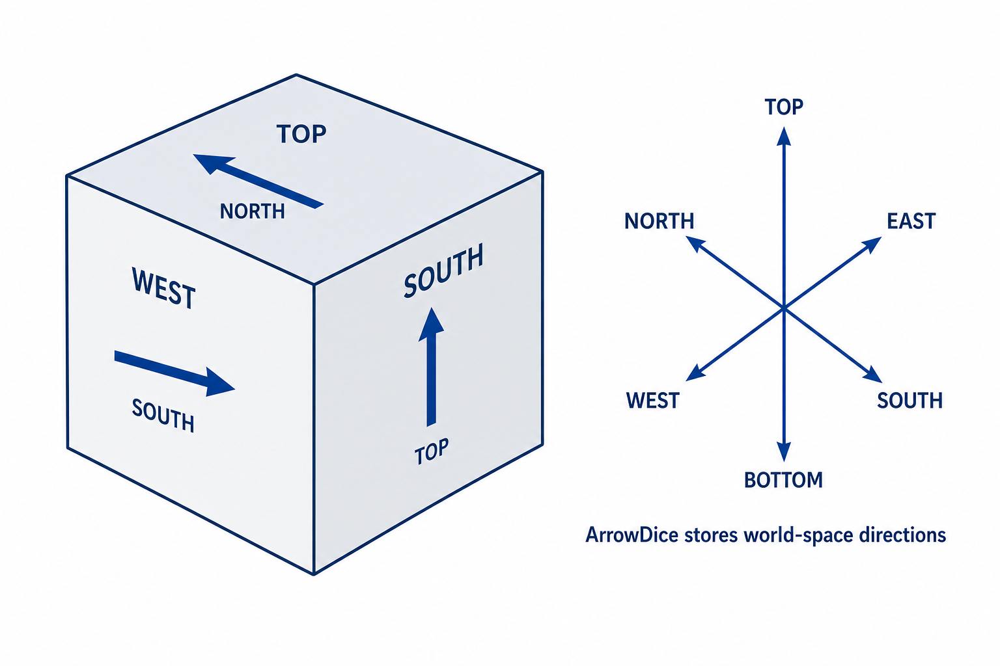

---
data:
  _extendedDependsOn: []
  _extendedRequiredBy: []
  _extendedVerifiedWith:
  - icon: ':heavy_check_mark:'
    path: verify/utilities/arrow_dice.test.cpp
    title: verify/utilities/arrow_dice.test.cpp
  - icon: ':heavy_check_mark:'
    path: verify/utilities/dice.test.cpp
    title: verify/utilities/dice.test.cpp
  _isVerificationFailed: false
  _pathExtension: hpp
  _verificationStatusIcon: ':heavy_check_mark:'
  attributes:
    links: []
  bundledCode: "#line 1 \"utilities/dice.hpp\"\n\n\n\n#include <array>\n#include <cstddef>\n\
    #include <optional>\n#include <stdexcept>\n#include <string>\n#include <utility>\n\
    #include <vector>\n\nnamespace m1une {\nnamespace utilities {\n\nenum class DiceFace\
    \ : std::size_t {\n    top,\n    bottom,\n    north,\n    south,\n    east,\n\
    \    west\n};\n\nenum class DiceDirection {\n    north,\n    south,\n    east,\n\
    \    west\n};\n\nconstexpr DiceFace opposite(DiceFace face) noexcept {\n    switch\
    \ (face) {\n        case DiceFace::top:\n            return DiceFace::bottom;\n\
    \        case DiceFace::bottom:\n            return DiceFace::top;\n        case\
    \ DiceFace::north:\n            return DiceFace::south;\n        case DiceFace::south:\n\
    \            return DiceFace::north;\n        case DiceFace::east:\n         \
    \   return DiceFace::west;\n        case DiceFace::west:\n            return DiceFace::east;\n\
    \    }\n    return DiceFace::top;\n}\n\nconstexpr DiceFace rotate_direction(\n\
    \    DiceFace direction,\n    DiceDirection rotation\n) noexcept {\n    switch\
    \ (rotation) {\n        case DiceDirection::north:\n            switch (direction)\
    \ {\n                case DiceFace::top:\n                    return DiceFace::north;\n\
    \                case DiceFace::north:\n                    return DiceFace::bottom;\n\
    \                case DiceFace::bottom:\n                    return DiceFace::south;\n\
    \                case DiceFace::south:\n                    return DiceFace::top;\n\
    \                default:\n                    return direction;\n           \
    \ }\n        case DiceDirection::south:\n            switch (direction) {\n  \
    \              case DiceFace::top:\n                    return DiceFace::south;\n\
    \                case DiceFace::south:\n                    return DiceFace::bottom;\n\
    \                case DiceFace::bottom:\n                    return DiceFace::north;\n\
    \                case DiceFace::north:\n                    return DiceFace::top;\n\
    \                default:\n                    return direction;\n           \
    \ }\n        case DiceDirection::east:\n            switch (direction) {\n   \
    \             case DiceFace::top:\n                    return DiceFace::east;\n\
    \                case DiceFace::east:\n                    return DiceFace::bottom;\n\
    \                case DiceFace::bottom:\n                    return DiceFace::west;\n\
    \                case DiceFace::west:\n                    return DiceFace::top;\n\
    \                default:\n                    return direction;\n           \
    \ }\n        case DiceDirection::west:\n            switch (direction) {\n   \
    \             case DiceFace::top:\n                    return DiceFace::west;\n\
    \                case DiceFace::west:\n                    return DiceFace::bottom;\n\
    \                case DiceFace::bottom:\n                    return DiceFace::east;\n\
    \                case DiceFace::east:\n                    return DiceFace::top;\n\
    \                default:\n                    return direction;\n           \
    \ }\n    }\n    return direction;\n}\n\nconstexpr DiceFace rotate_direction_clockwise(DiceFace\
    \ direction) noexcept {\n    switch (direction) {\n        case DiceFace::north:\n\
    \            return DiceFace::east;\n        case DiceFace::east:\n          \
    \  return DiceFace::south;\n        case DiceFace::south:\n            return\
    \ DiceFace::west;\n        case DiceFace::west:\n            return DiceFace::north;\n\
    \        default:\n            return direction;\n    }\n}\n\nconstexpr DiceFace\
    \ rotate_direction_counterclockwise(DiceFace direction) noexcept {\n    switch\
    \ (direction) {\n        case DiceFace::north:\n            return DiceFace::west;\n\
    \        case DiceFace::west:\n            return DiceFace::south;\n        case\
    \ DiceFace::south:\n            return DiceFace::east;\n        case DiceFace::east:\n\
    \            return DiceFace::north;\n        default:\n            return direction;\n\
    \    }\n}\n\ntemplate <typename T>\nclass Dice {\nprivate:\n    static constexpr\
    \ std::size_t face_count = 6;\n    std::array<T, face_count> faces_;\n\n    static\
    \ constexpr std::size_t index(DiceFace face) noexcept {\n        return static_cast<std::size_t>(face);\n\
    \    }\n\npublic:\n    constexpr Dice(\n        T top,\n        T bottom,\n  \
    \      T north,\n        T south,\n        T east,\n        T west\n    )\n  \
    \      : faces_{\n              std::move(top),\n              std::move(bottom),\n\
    \              std::move(north),\n              std::move(south),\n          \
    \    std::move(east),\n              std::move(west)\n          } {}\n\n    explicit\
    \ constexpr Dice(std::array<T, face_count> faces)\n        : faces_(std::move(faces))\
    \ {}\n\n    [[nodiscard]] constexpr const T& operator[](DiceFace face) const noexcept\
    \ {\n        return faces_[index(face)];\n    }\n\n    [[nodiscard]] constexpr\
    \ T& operator[](DiceFace face) noexcept {\n        return faces_[index(face)];\n\
    \    }\n\n    [[nodiscard]] constexpr const T& top() const noexcept {\n      \
    \  return (*this)[DiceFace::top];\n    }\n\n    [[nodiscard]] constexpr const\
    \ T& bottom() const noexcept {\n        return (*this)[DiceFace::bottom];\n  \
    \  }\n\n    [[nodiscard]] constexpr const T& north() const noexcept {\n      \
    \  return (*this)[DiceFace::north];\n    }\n\n    [[nodiscard]] constexpr const\
    \ T& south() const noexcept {\n        return (*this)[DiceFace::south];\n    }\n\
    \n    [[nodiscard]] constexpr const T& east() const noexcept {\n        return\
    \ (*this)[DiceFace::east];\n    }\n\n    [[nodiscard]] constexpr const T& west()\
    \ const noexcept {\n        return (*this)[DiceFace::west];\n    }\n\n    [[nodiscard]]\
    \ constexpr const std::array<T, face_count>& faces() const noexcept {\n      \
    \  return faces_;\n    }\n\n    constexpr Dice& roll_north() {\n        T old_top\
    \ = std::move((*this)[DiceFace::top]);\n        (*this)[DiceFace::top] = std::move((*this)[DiceFace::south]);\n\
    \        (*this)[DiceFace::south] = std::move((*this)[DiceFace::bottom]);\n  \
    \      (*this)[DiceFace::bottom] = std::move((*this)[DiceFace::north]);\n    \
    \    (*this)[DiceFace::north] = std::move(old_top);\n        return *this;\n \
    \   }\n\n    constexpr Dice& roll_south() {\n        T old_top = std::move((*this)[DiceFace::top]);\n\
    \        (*this)[DiceFace::top] = std::move((*this)[DiceFace::north]);\n     \
    \   (*this)[DiceFace::north] = std::move((*this)[DiceFace::bottom]);\n       \
    \ (*this)[DiceFace::bottom] = std::move((*this)[DiceFace::south]);\n        (*this)[DiceFace::south]\
    \ = std::move(old_top);\n        return *this;\n    }\n\n    constexpr Dice& roll_east()\
    \ {\n        T old_top = std::move((*this)[DiceFace::top]);\n        (*this)[DiceFace::top]\
    \ = std::move((*this)[DiceFace::west]);\n        (*this)[DiceFace::west] = std::move((*this)[DiceFace::bottom]);\n\
    \        (*this)[DiceFace::bottom] = std::move((*this)[DiceFace::east]);\n   \
    \     (*this)[DiceFace::east] = std::move(old_top);\n        return *this;\n \
    \   }\n\n    constexpr Dice& roll_west() {\n        T old_top = std::move((*this)[DiceFace::top]);\n\
    \        (*this)[DiceFace::top] = std::move((*this)[DiceFace::east]);\n      \
    \  (*this)[DiceFace::east] = std::move((*this)[DiceFace::bottom]);\n        (*this)[DiceFace::bottom]\
    \ = std::move((*this)[DiceFace::west]);\n        (*this)[DiceFace::west] = std::move(old_top);\n\
    \        return *this;\n    }\n\n    constexpr Dice& roll(DiceDirection direction)\
    \ {\n        switch (direction) {\n            case DiceDirection::north:\n  \
    \              return roll_north();\n            case DiceDirection::south:\n\
    \                return roll_south();\n            case DiceDirection::east:\n\
    \                return roll_east();\n            case DiceDirection::west:\n\
    \                return roll_west();\n        }\n        return *this;\n    }\n\
    \n    constexpr Dice& rotate_clockwise() {\n        T old_north = std::move((*this)[DiceFace::north]);\n\
    \        (*this)[DiceFace::north] = std::move((*this)[DiceFace::west]);\n    \
    \    (*this)[DiceFace::west] = std::move((*this)[DiceFace::south]);\n        (*this)[DiceFace::south]\
    \ = std::move((*this)[DiceFace::east]);\n        (*this)[DiceFace::east] = std::move(old_north);\n\
    \        return *this;\n    }\n\n    constexpr Dice& rotate_counterclockwise()\
    \ {\n        T old_north = std::move((*this)[DiceFace::north]);\n        (*this)[DiceFace::north]\
    \ = std::move((*this)[DiceFace::east]);\n        (*this)[DiceFace::east] = std::move((*this)[DiceFace::south]);\n\
    \        (*this)[DiceFace::south] = std::move((*this)[DiceFace::west]);\n    \
    \    (*this)[DiceFace::west] = std::move(old_north);\n        return *this;\n\
    \    }\n\n    [[nodiscard]] constexpr std::array<Dice, 24> orientations() const\
    \ {\n        Dice top_top = *this;\n        Dice north_top = *this;\n        north_top.roll_south();\n\
    \        Dice south_top = *this;\n        south_top.roll_north();\n        Dice\
    \ east_top = *this;\n        east_top.roll_west();\n        Dice west_top = *this;\n\
    \        west_top.roll_east();\n        Dice bottom_top = *this;\n        bottom_top.roll_north().roll_north();\n\
    \n        std::array<Dice, 6> top_orientations{\n            std::move(top_top),\n\
    \            std::move(north_top),\n            std::move(south_top),\n      \
    \      std::move(east_top),\n            std::move(west_top),\n            std::move(bottom_top)\n\
    \        };\n\n        std::array<Dice, 24> result{\n            *this, *this,\
    \ *this, *this, *this, *this,\n            *this, *this, *this, *this, *this,\
    \ *this,\n            *this, *this, *this, *this, *this, *this,\n            *this,\
    \ *this, *this, *this, *this, *this\n        };\n        std::size_t result_index\
    \ = 0;\n        for (Dice oriented : top_orientations) {\n            for (int\
    \ rotation = 0; rotation < 4; ++rotation) {\n                result[result_index++]\
    \ = oriented;\n                oriented.rotate_clockwise();\n            }\n \
    \       }\n        return result;\n    }\n\n    [[nodiscard]] constexpr std::optional<Dice>\
    \ orientation(\n        const T& top_value,\n        const T& south_value\n  \
    \  ) const {\n        for (const Dice& oriented : orientations()) {\n        \
    \    if (oriented.top() == top_value && oriented.south() == south_value) {\n \
    \               return oriented;\n            }\n        }\n        return std::nullopt;\n\
    \    }\n\n    [[nodiscard]] constexpr bool equivalent(const Dice& other) const\
    \ {\n        for (const Dice& oriented : orientations()) {\n            if (oriented\
    \ == other) {\n                return true;\n            }\n        }\n      \
    \  return false;\n    }\n\n    friend constexpr bool operator==(const Dice&, const\
    \ Dice&) = default;\n};\n\nclass ArrowDice {\nprivate:\n    struct Vector {\n\
    \        int x;\n        int y;\n        int z;\n\n        friend constexpr bool\
    \ operator==(const Vector&, const Vector&) = default;\n    };\n\n    struct Frame\
    \ {\n        Vector normal;\n        Vector up;\n        Vector right;\n\n   \
    \     friend constexpr bool operator==(const Frame&, const Frame&) = default;\n\
    \    };\n\n    Dice<DiceFace> arrows_;\n\n    static constexpr Vector negate(Vector\
    \ vector) noexcept {\n        return Vector{-vector.x, -vector.y, -vector.z};\n\
    \    }\n\n    static constexpr DiceFace vector_to_face(Vector vector) {\n    \
    \    if (vector == Vector{0, 0, 1}) return DiceFace::top;\n        if (vector\
    \ == Vector{0, 0, -1}) return DiceFace::bottom;\n        if (vector == Vector{0,\
    \ 1, 0}) return DiceFace::north;\n        if (vector == Vector{0, -1, 0}) return\
    \ DiceFace::south;\n        if (vector == Vector{1, 0, 0}) return DiceFace::east;\n\
    \        if (vector == Vector{-1, 0, 0}) return DiceFace::west;\n        throw\
    \ std::invalid_argument(\"vector is not a cube direction\");\n    }\n\n    static\
    \ constexpr Frame adjacent_frame(\n        const Frame& frame,\n        DiceDirection\
    \ direction\n    ) noexcept {\n        switch (direction) {\n            case\
    \ DiceDirection::north:\n                return Frame{frame.up, negate(frame.normal),\
    \ frame.right};\n            case DiceDirection::south:\n                return\
    \ Frame{negate(frame.up), frame.normal, frame.right};\n            case DiceDirection::east:\n\
    \                return Frame{frame.right, frame.up, negate(frame.normal)};\n\
    \            case DiceDirection::west:\n                return Frame{negate(frame.right),\
    \ frame.up, frame.normal};\n        }\n        return frame;\n    }\n\n    static\
    \ constexpr DiceFace arrow_from_character(\n        char arrow,\n        const\
    \ Frame& frame\n    ) {\n        if (arrow == '^') return vector_to_face(frame.up);\n\
    \        if (arrow == 'v') return vector_to_face(negate(frame.up));\n        if\
    \ (arrow == '>') return vector_to_face(frame.right);\n        if (arrow == '<')\
    \ return vector_to_face(negate(frame.right));\n        throw std::invalid_argument(\"\
    arrow dice net contains an invalid character\");\n    }\n\n    constexpr void\
    \ rotate_arrows(DiceDirection direction) noexcept {\n        for (DiceFace face\
    \ : all_faces()) {\n            arrows_[face] = rotate_direction(arrows_[face],\
    \ direction);\n        }\n    }\n\n    static constexpr std::array<DiceFace, 6>\
    \ all_faces() noexcept {\n        return std::array<DiceFace, 6>{\n          \
    \  DiceFace::top,\n            DiceFace::bottom,\n            DiceFace::north,\n\
    \            DiceFace::south,\n            DiceFace::east,\n            DiceFace::west\n\
    \        };\n    }\n\npublic:\n    constexpr ArrowDice(\n        DiceFace top,\n\
    \        DiceFace bottom,\n        DiceFace north,\n        DiceFace south,\n\
    \        DiceFace east,\n        DiceFace west\n    )\n        : arrows_(top,\
    \ bottom, north, south, east, west) {}\n\n    explicit constexpr ArrowDice(Dice<DiceFace>\
    \ arrows)\n        : arrows_(std::move(arrows)) {}\n\n    [[nodiscard]] constexpr\
    \ DiceFace arrow(DiceFace face) const noexcept {\n        return arrows_[face];\n\
    \    }\n\n    [[nodiscard]] constexpr const Dice<DiceFace>& arrows() const noexcept\
    \ {\n        return arrows_;\n    }\n\n    constexpr ArrowDice& roll(DiceDirection\
    \ direction) {\n        arrows_.roll(direction);\n        rotate_arrows(direction);\n\
    \        return *this;\n    }\n\n    constexpr ArrowDice& roll_north() {\n   \
    \     return roll(DiceDirection::north);\n    }\n\n    constexpr ArrowDice& roll_south()\
    \ {\n        return roll(DiceDirection::south);\n    }\n\n    constexpr ArrowDice&\
    \ roll_east() {\n        return roll(DiceDirection::east);\n    }\n\n    constexpr\
    \ ArrowDice& roll_west() {\n        return roll(DiceDirection::west);\n    }\n\
    \n    constexpr ArrowDice& rotate_clockwise() {\n        arrows_.rotate_clockwise();\n\
    \        for (DiceFace face : all_faces()) {\n            arrows_[face] = rotate_direction_clockwise(arrows_[face]);\n\
    \        }\n        return *this;\n    }\n\n    constexpr ArrowDice& rotate_counterclockwise()\
    \ {\n        arrows_.rotate_counterclockwise();\n        for (DiceFace face :\
    \ all_faces()) {\n            arrows_[face] = rotate_direction_counterclockwise(arrows_[face]);\n\
    \        }\n        return *this;\n    }\n\n    [[nodiscard]] constexpr std::array<ArrowDice,\
    \ 24> orientations() const {\n        ArrowDice top_top = *this;\n        ArrowDice\
    \ north_top = *this;\n        north_top.roll_south();\n        ArrowDice south_top\
    \ = *this;\n        south_top.roll_north();\n        ArrowDice east_top = *this;\n\
    \        east_top.roll_west();\n        ArrowDice west_top = *this;\n        west_top.roll_east();\n\
    \        ArrowDice bottom_top = *this;\n        bottom_top.roll_north().roll_north();\n\
    \n        std::array<ArrowDice, 6> top_orientations{\n            top_top,\n \
    \           north_top,\n            south_top,\n            east_top,\n      \
    \      west_top,\n            bottom_top\n        };\n        std::array<ArrowDice,\
    \ 24> result{\n            *this, *this, *this, *this, *this, *this,\n       \
    \     *this, *this, *this, *this, *this, *this,\n            *this, *this, *this,\
    \ *this, *this, *this,\n            *this, *this, *this, *this, *this, *this\n\
    \        };\n\n        std::size_t result_index = 0;\n        for (ArrowDice oriented\
    \ : top_orientations) {\n            for (int rotation = 0; rotation < 4; ++rotation)\
    \ {\n                result[result_index++] = oriented;\n                oriented.rotate_clockwise();\n\
    \            }\n        }\n        return result;\n    }\n\n    [[nodiscard]]\
    \ constexpr int difference(const ArrowDice& other) const noexcept {\n        int\
    \ result = 0;\n        for (DiceFace face : all_faces()) {\n            result\
    \ += arrow(face) != other.arrow(face);\n        }\n        return result;\n  \
    \  }\n\n    [[nodiscard]] constexpr int distance(const ArrowDice& other) const\
    \ {\n        int result = 6;\n        for (const ArrowDice& oriented : orientations())\
    \ {\n            int current = oriented.difference(other);\n            if (current\
    \ < result) result = current;\n        }\n        return result;\n    }\n\n  \
    \  [[nodiscard]] static ArrowDice from_net(\n        const std::vector<std::string>&\
    \ net,\n        char empty = '.'\n    ) {\n        if (net.empty()) {\n      \
    \      throw std::invalid_argument(\"arrow dice net is empty\");\n        }\n\
    \        std::size_t width = net.front().size();\n        if (width == 0) {\n\
    \            throw std::invalid_argument(\"arrow dice net is empty\");\n     \
    \   }\n        for (const std::string& row : net) {\n            if (row.size()\
    \ != width) {\n                throw std::invalid_argument(\"arrow dice net must\
    \ be rectangular\");\n            }\n        }\n\n        int height = static_cast<int>(net.size());\n\
    \        int integer_width = static_cast<int>(width);\n        std::vector<std::vector<std::optional<Frame>>>\
    \ frames(\n            net.size(),\n            std::vector<std::optional<Frame>>(width)\n\
    \        );\n        auto character_at = [&](int row, int column) -> char {\n\
    \            return net[static_cast<std::size_t>(row)]\n                     \
    \ [static_cast<std::size_t>(column)];\n        };\n        auto frame_at = [&](int\
    \ row, int column) -> std::optional<Frame>& {\n            return frames[static_cast<std::size_t>(row)]\n\
    \                         [static_cast<std::size_t>(column)];\n        };\n  \
    \      std::vector<std::pair<int, int>> queue;\n        int face_count = 0;\n\
    \        for (int row = 0; row < height; ++row) {\n            for (int column\
    \ = 0; column < integer_width; ++column) {\n                if (character_at(row,\
    \ column) != empty) {\n                    ++face_count;\n                   \
    \ if (queue.empty()) queue.emplace_back(row, column);\n                }\n   \
    \         }\n        }\n        if (face_count != 6) {\n            throw std::invalid_argument(\"\
    arrow dice net must contain six faces\");\n        }\n\n        Frame initial{\n\
    \            Vector{0, 0, 1},\n            Vector{0, 1, 0},\n            Vector{1,\
    \ 0, 0}\n        };\n        frame_at(queue.front().first, queue.front().second)\
    \ = initial;\n\n        constexpr std::array<int, 4> row_delta{-1, 1, 0, 0};\n\
    \        constexpr std::array<int, 4> column_delta{0, 0, 1, -1};\n        constexpr\
    \ std::array<DiceDirection, 4> directions{\n            DiceDirection::north,\n\
    \            DiceDirection::south,\n            DiceDirection::east,\n       \
    \     DiceDirection::west\n        };\n        for (std::size_t head = 0; head\
    \ < queue.size(); ++head) {\n            int row = queue[head].first;\n      \
    \      int column = queue[head].second;\n            Frame frame = *frame_at(row,\
    \ column);\n            for (std::size_t edge = 0; edge < directions.size(); ++edge)\
    \ {\n                int next_row = row + row_delta[edge];\n                int\
    \ next_column = column + column_delta[edge];\n                if (\n         \
    \           next_row < 0 || next_row >= height ||\n                    next_column\
    \ < 0 || next_column >= integer_width ||\n                    character_at(next_row,\
    \ next_column) == empty\n                ) {\n                    continue;\n\
    \                }\n\n                Frame next_frame = adjacent_frame(frame,\
    \ directions[edge]);\n                std::optional<Frame>& known = frame_at(next_row,\
    \ next_column);\n                if (!known.has_value()) {\n                 \
    \   known = next_frame;\n                    queue.emplace_back(next_row, next_column);\n\
    \                } else if (*known != next_frame) {\n                    throw\
    \ std::invalid_argument(\"arrow dice net folds inconsistently\");\n          \
    \      }\n            }\n        }\n        if (queue.size() != 6) {\n       \
    \     throw std::invalid_argument(\"arrow dice net is disconnected\");\n     \
    \   }\n\n        std::array<std::optional<DiceFace>, 6> arrows;\n        for (const\
    \ std::pair<int, int>& cell : queue) {\n            int row = cell.first;\n  \
    \          int column = cell.second;\n            Frame frame = *frame_at(row,\
    \ column);\n            DiceFace face = vector_to_face(frame.normal);\n      \
    \      std::optional<DiceFace>& slot =\n                arrows[static_cast<std::size_t>(face)];\n\
    \            if (slot.has_value()) {\n                throw std::invalid_argument(\"\
    arrow dice net overlaps when folded\");\n            }\n            slot = arrow_from_character(character_at(row,\
    \ column), frame);\n        }\n        for (const std::optional<DiceFace>& arrow\
    \ : arrows) {\n            if (!arrow.has_value()) {\n                throw std::invalid_argument(\"\
    arrow dice net does not form a cube\");\n            }\n        }\n\n        return\
    \ ArrowDice(\n            *arrows[static_cast<std::size_t>(DiceFace::top)],\n\
    \            *arrows[static_cast<std::size_t>(DiceFace::bottom)],\n          \
    \  *arrows[static_cast<std::size_t>(DiceFace::north)],\n            *arrows[static_cast<std::size_t>(DiceFace::south)],\n\
    \            *arrows[static_cast<std::size_t>(DiceFace::east)],\n            *arrows[static_cast<std::size_t>(DiceFace::west)]\n\
    \        );\n    }\n\n    friend constexpr bool operator==(const ArrowDice&, const\
    \ ArrowDice&) = default;\n};\n\n}  // namespace utilities\n}  // namespace m1une\n\
    \n\n"
  code: "#ifndef M1UNE_DICE_HPP\n#define M1UNE_DICE_HPP 1\n\n#include <array>\n#include\
    \ <cstddef>\n#include <optional>\n#include <stdexcept>\n#include <string>\n#include\
    \ <utility>\n#include <vector>\n\nnamespace m1une {\nnamespace utilities {\n\n\
    enum class DiceFace : std::size_t {\n    top,\n    bottom,\n    north,\n    south,\n\
    \    east,\n    west\n};\n\nenum class DiceDirection {\n    north,\n    south,\n\
    \    east,\n    west\n};\n\nconstexpr DiceFace opposite(DiceFace face) noexcept\
    \ {\n    switch (face) {\n        case DiceFace::top:\n            return DiceFace::bottom;\n\
    \        case DiceFace::bottom:\n            return DiceFace::top;\n        case\
    \ DiceFace::north:\n            return DiceFace::south;\n        case DiceFace::south:\n\
    \            return DiceFace::north;\n        case DiceFace::east:\n         \
    \   return DiceFace::west;\n        case DiceFace::west:\n            return DiceFace::east;\n\
    \    }\n    return DiceFace::top;\n}\n\nconstexpr DiceFace rotate_direction(\n\
    \    DiceFace direction,\n    DiceDirection rotation\n) noexcept {\n    switch\
    \ (rotation) {\n        case DiceDirection::north:\n            switch (direction)\
    \ {\n                case DiceFace::top:\n                    return DiceFace::north;\n\
    \                case DiceFace::north:\n                    return DiceFace::bottom;\n\
    \                case DiceFace::bottom:\n                    return DiceFace::south;\n\
    \                case DiceFace::south:\n                    return DiceFace::top;\n\
    \                default:\n                    return direction;\n           \
    \ }\n        case DiceDirection::south:\n            switch (direction) {\n  \
    \              case DiceFace::top:\n                    return DiceFace::south;\n\
    \                case DiceFace::south:\n                    return DiceFace::bottom;\n\
    \                case DiceFace::bottom:\n                    return DiceFace::north;\n\
    \                case DiceFace::north:\n                    return DiceFace::top;\n\
    \                default:\n                    return direction;\n           \
    \ }\n        case DiceDirection::east:\n            switch (direction) {\n   \
    \             case DiceFace::top:\n                    return DiceFace::east;\n\
    \                case DiceFace::east:\n                    return DiceFace::bottom;\n\
    \                case DiceFace::bottom:\n                    return DiceFace::west;\n\
    \                case DiceFace::west:\n                    return DiceFace::top;\n\
    \                default:\n                    return direction;\n           \
    \ }\n        case DiceDirection::west:\n            switch (direction) {\n   \
    \             case DiceFace::top:\n                    return DiceFace::west;\n\
    \                case DiceFace::west:\n                    return DiceFace::bottom;\n\
    \                case DiceFace::bottom:\n                    return DiceFace::east;\n\
    \                case DiceFace::east:\n                    return DiceFace::top;\n\
    \                default:\n                    return direction;\n           \
    \ }\n    }\n    return direction;\n}\n\nconstexpr DiceFace rotate_direction_clockwise(DiceFace\
    \ direction) noexcept {\n    switch (direction) {\n        case DiceFace::north:\n\
    \            return DiceFace::east;\n        case DiceFace::east:\n          \
    \  return DiceFace::south;\n        case DiceFace::south:\n            return\
    \ DiceFace::west;\n        case DiceFace::west:\n            return DiceFace::north;\n\
    \        default:\n            return direction;\n    }\n}\n\nconstexpr DiceFace\
    \ rotate_direction_counterclockwise(DiceFace direction) noexcept {\n    switch\
    \ (direction) {\n        case DiceFace::north:\n            return DiceFace::west;\n\
    \        case DiceFace::west:\n            return DiceFace::south;\n        case\
    \ DiceFace::south:\n            return DiceFace::east;\n        case DiceFace::east:\n\
    \            return DiceFace::north;\n        default:\n            return direction;\n\
    \    }\n}\n\ntemplate <typename T>\nclass Dice {\nprivate:\n    static constexpr\
    \ std::size_t face_count = 6;\n    std::array<T, face_count> faces_;\n\n    static\
    \ constexpr std::size_t index(DiceFace face) noexcept {\n        return static_cast<std::size_t>(face);\n\
    \    }\n\npublic:\n    constexpr Dice(\n        T top,\n        T bottom,\n  \
    \      T north,\n        T south,\n        T east,\n        T west\n    )\n  \
    \      : faces_{\n              std::move(top),\n              std::move(bottom),\n\
    \              std::move(north),\n              std::move(south),\n          \
    \    std::move(east),\n              std::move(west)\n          } {}\n\n    explicit\
    \ constexpr Dice(std::array<T, face_count> faces)\n        : faces_(std::move(faces))\
    \ {}\n\n    [[nodiscard]] constexpr const T& operator[](DiceFace face) const noexcept\
    \ {\n        return faces_[index(face)];\n    }\n\n    [[nodiscard]] constexpr\
    \ T& operator[](DiceFace face) noexcept {\n        return faces_[index(face)];\n\
    \    }\n\n    [[nodiscard]] constexpr const T& top() const noexcept {\n      \
    \  return (*this)[DiceFace::top];\n    }\n\n    [[nodiscard]] constexpr const\
    \ T& bottom() const noexcept {\n        return (*this)[DiceFace::bottom];\n  \
    \  }\n\n    [[nodiscard]] constexpr const T& north() const noexcept {\n      \
    \  return (*this)[DiceFace::north];\n    }\n\n    [[nodiscard]] constexpr const\
    \ T& south() const noexcept {\n        return (*this)[DiceFace::south];\n    }\n\
    \n    [[nodiscard]] constexpr const T& east() const noexcept {\n        return\
    \ (*this)[DiceFace::east];\n    }\n\n    [[nodiscard]] constexpr const T& west()\
    \ const noexcept {\n        return (*this)[DiceFace::west];\n    }\n\n    [[nodiscard]]\
    \ constexpr const std::array<T, face_count>& faces() const noexcept {\n      \
    \  return faces_;\n    }\n\n    constexpr Dice& roll_north() {\n        T old_top\
    \ = std::move((*this)[DiceFace::top]);\n        (*this)[DiceFace::top] = std::move((*this)[DiceFace::south]);\n\
    \        (*this)[DiceFace::south] = std::move((*this)[DiceFace::bottom]);\n  \
    \      (*this)[DiceFace::bottom] = std::move((*this)[DiceFace::north]);\n    \
    \    (*this)[DiceFace::north] = std::move(old_top);\n        return *this;\n \
    \   }\n\n    constexpr Dice& roll_south() {\n        T old_top = std::move((*this)[DiceFace::top]);\n\
    \        (*this)[DiceFace::top] = std::move((*this)[DiceFace::north]);\n     \
    \   (*this)[DiceFace::north] = std::move((*this)[DiceFace::bottom]);\n       \
    \ (*this)[DiceFace::bottom] = std::move((*this)[DiceFace::south]);\n        (*this)[DiceFace::south]\
    \ = std::move(old_top);\n        return *this;\n    }\n\n    constexpr Dice& roll_east()\
    \ {\n        T old_top = std::move((*this)[DiceFace::top]);\n        (*this)[DiceFace::top]\
    \ = std::move((*this)[DiceFace::west]);\n        (*this)[DiceFace::west] = std::move((*this)[DiceFace::bottom]);\n\
    \        (*this)[DiceFace::bottom] = std::move((*this)[DiceFace::east]);\n   \
    \     (*this)[DiceFace::east] = std::move(old_top);\n        return *this;\n \
    \   }\n\n    constexpr Dice& roll_west() {\n        T old_top = std::move((*this)[DiceFace::top]);\n\
    \        (*this)[DiceFace::top] = std::move((*this)[DiceFace::east]);\n      \
    \  (*this)[DiceFace::east] = std::move((*this)[DiceFace::bottom]);\n        (*this)[DiceFace::bottom]\
    \ = std::move((*this)[DiceFace::west]);\n        (*this)[DiceFace::west] = std::move(old_top);\n\
    \        return *this;\n    }\n\n    constexpr Dice& roll(DiceDirection direction)\
    \ {\n        switch (direction) {\n            case DiceDirection::north:\n  \
    \              return roll_north();\n            case DiceDirection::south:\n\
    \                return roll_south();\n            case DiceDirection::east:\n\
    \                return roll_east();\n            case DiceDirection::west:\n\
    \                return roll_west();\n        }\n        return *this;\n    }\n\
    \n    constexpr Dice& rotate_clockwise() {\n        T old_north = std::move((*this)[DiceFace::north]);\n\
    \        (*this)[DiceFace::north] = std::move((*this)[DiceFace::west]);\n    \
    \    (*this)[DiceFace::west] = std::move((*this)[DiceFace::south]);\n        (*this)[DiceFace::south]\
    \ = std::move((*this)[DiceFace::east]);\n        (*this)[DiceFace::east] = std::move(old_north);\n\
    \        return *this;\n    }\n\n    constexpr Dice& rotate_counterclockwise()\
    \ {\n        T old_north = std::move((*this)[DiceFace::north]);\n        (*this)[DiceFace::north]\
    \ = std::move((*this)[DiceFace::east]);\n        (*this)[DiceFace::east] = std::move((*this)[DiceFace::south]);\n\
    \        (*this)[DiceFace::south] = std::move((*this)[DiceFace::west]);\n    \
    \    (*this)[DiceFace::west] = std::move(old_north);\n        return *this;\n\
    \    }\n\n    [[nodiscard]] constexpr std::array<Dice, 24> orientations() const\
    \ {\n        Dice top_top = *this;\n        Dice north_top = *this;\n        north_top.roll_south();\n\
    \        Dice south_top = *this;\n        south_top.roll_north();\n        Dice\
    \ east_top = *this;\n        east_top.roll_west();\n        Dice west_top = *this;\n\
    \        west_top.roll_east();\n        Dice bottom_top = *this;\n        bottom_top.roll_north().roll_north();\n\
    \n        std::array<Dice, 6> top_orientations{\n            std::move(top_top),\n\
    \            std::move(north_top),\n            std::move(south_top),\n      \
    \      std::move(east_top),\n            std::move(west_top),\n            std::move(bottom_top)\n\
    \        };\n\n        std::array<Dice, 24> result{\n            *this, *this,\
    \ *this, *this, *this, *this,\n            *this, *this, *this, *this, *this,\
    \ *this,\n            *this, *this, *this, *this, *this, *this,\n            *this,\
    \ *this, *this, *this, *this, *this\n        };\n        std::size_t result_index\
    \ = 0;\n        for (Dice oriented : top_orientations) {\n            for (int\
    \ rotation = 0; rotation < 4; ++rotation) {\n                result[result_index++]\
    \ = oriented;\n                oriented.rotate_clockwise();\n            }\n \
    \       }\n        return result;\n    }\n\n    [[nodiscard]] constexpr std::optional<Dice>\
    \ orientation(\n        const T& top_value,\n        const T& south_value\n  \
    \  ) const {\n        for (const Dice& oriented : orientations()) {\n        \
    \    if (oriented.top() == top_value && oriented.south() == south_value) {\n \
    \               return oriented;\n            }\n        }\n        return std::nullopt;\n\
    \    }\n\n    [[nodiscard]] constexpr bool equivalent(const Dice& other) const\
    \ {\n        for (const Dice& oriented : orientations()) {\n            if (oriented\
    \ == other) {\n                return true;\n            }\n        }\n      \
    \  return false;\n    }\n\n    friend constexpr bool operator==(const Dice&, const\
    \ Dice&) = default;\n};\n\nclass ArrowDice {\nprivate:\n    struct Vector {\n\
    \        int x;\n        int y;\n        int z;\n\n        friend constexpr bool\
    \ operator==(const Vector&, const Vector&) = default;\n    };\n\n    struct Frame\
    \ {\n        Vector normal;\n        Vector up;\n        Vector right;\n\n   \
    \     friend constexpr bool operator==(const Frame&, const Frame&) = default;\n\
    \    };\n\n    Dice<DiceFace> arrows_;\n\n    static constexpr Vector negate(Vector\
    \ vector) noexcept {\n        return Vector{-vector.x, -vector.y, -vector.z};\n\
    \    }\n\n    static constexpr DiceFace vector_to_face(Vector vector) {\n    \
    \    if (vector == Vector{0, 0, 1}) return DiceFace::top;\n        if (vector\
    \ == Vector{0, 0, -1}) return DiceFace::bottom;\n        if (vector == Vector{0,\
    \ 1, 0}) return DiceFace::north;\n        if (vector == Vector{0, -1, 0}) return\
    \ DiceFace::south;\n        if (vector == Vector{1, 0, 0}) return DiceFace::east;\n\
    \        if (vector == Vector{-1, 0, 0}) return DiceFace::west;\n        throw\
    \ std::invalid_argument(\"vector is not a cube direction\");\n    }\n\n    static\
    \ constexpr Frame adjacent_frame(\n        const Frame& frame,\n        DiceDirection\
    \ direction\n    ) noexcept {\n        switch (direction) {\n            case\
    \ DiceDirection::north:\n                return Frame{frame.up, negate(frame.normal),\
    \ frame.right};\n            case DiceDirection::south:\n                return\
    \ Frame{negate(frame.up), frame.normal, frame.right};\n            case DiceDirection::east:\n\
    \                return Frame{frame.right, frame.up, negate(frame.normal)};\n\
    \            case DiceDirection::west:\n                return Frame{negate(frame.right),\
    \ frame.up, frame.normal};\n        }\n        return frame;\n    }\n\n    static\
    \ constexpr DiceFace arrow_from_character(\n        char arrow,\n        const\
    \ Frame& frame\n    ) {\n        if (arrow == '^') return vector_to_face(frame.up);\n\
    \        if (arrow == 'v') return vector_to_face(negate(frame.up));\n        if\
    \ (arrow == '>') return vector_to_face(frame.right);\n        if (arrow == '<')\
    \ return vector_to_face(negate(frame.right));\n        throw std::invalid_argument(\"\
    arrow dice net contains an invalid character\");\n    }\n\n    constexpr void\
    \ rotate_arrows(DiceDirection direction) noexcept {\n        for (DiceFace face\
    \ : all_faces()) {\n            arrows_[face] = rotate_direction(arrows_[face],\
    \ direction);\n        }\n    }\n\n    static constexpr std::array<DiceFace, 6>\
    \ all_faces() noexcept {\n        return std::array<DiceFace, 6>{\n          \
    \  DiceFace::top,\n            DiceFace::bottom,\n            DiceFace::north,\n\
    \            DiceFace::south,\n            DiceFace::east,\n            DiceFace::west\n\
    \        };\n    }\n\npublic:\n    constexpr ArrowDice(\n        DiceFace top,\n\
    \        DiceFace bottom,\n        DiceFace north,\n        DiceFace south,\n\
    \        DiceFace east,\n        DiceFace west\n    )\n        : arrows_(top,\
    \ bottom, north, south, east, west) {}\n\n    explicit constexpr ArrowDice(Dice<DiceFace>\
    \ arrows)\n        : arrows_(std::move(arrows)) {}\n\n    [[nodiscard]] constexpr\
    \ DiceFace arrow(DiceFace face) const noexcept {\n        return arrows_[face];\n\
    \    }\n\n    [[nodiscard]] constexpr const Dice<DiceFace>& arrows() const noexcept\
    \ {\n        return arrows_;\n    }\n\n    constexpr ArrowDice& roll(DiceDirection\
    \ direction) {\n        arrows_.roll(direction);\n        rotate_arrows(direction);\n\
    \        return *this;\n    }\n\n    constexpr ArrowDice& roll_north() {\n   \
    \     return roll(DiceDirection::north);\n    }\n\n    constexpr ArrowDice& roll_south()\
    \ {\n        return roll(DiceDirection::south);\n    }\n\n    constexpr ArrowDice&\
    \ roll_east() {\n        return roll(DiceDirection::east);\n    }\n\n    constexpr\
    \ ArrowDice& roll_west() {\n        return roll(DiceDirection::west);\n    }\n\
    \n    constexpr ArrowDice& rotate_clockwise() {\n        arrows_.rotate_clockwise();\n\
    \        for (DiceFace face : all_faces()) {\n            arrows_[face] = rotate_direction_clockwise(arrows_[face]);\n\
    \        }\n        return *this;\n    }\n\n    constexpr ArrowDice& rotate_counterclockwise()\
    \ {\n        arrows_.rotate_counterclockwise();\n        for (DiceFace face :\
    \ all_faces()) {\n            arrows_[face] = rotate_direction_counterclockwise(arrows_[face]);\n\
    \        }\n        return *this;\n    }\n\n    [[nodiscard]] constexpr std::array<ArrowDice,\
    \ 24> orientations() const {\n        ArrowDice top_top = *this;\n        ArrowDice\
    \ north_top = *this;\n        north_top.roll_south();\n        ArrowDice south_top\
    \ = *this;\n        south_top.roll_north();\n        ArrowDice east_top = *this;\n\
    \        east_top.roll_west();\n        ArrowDice west_top = *this;\n        west_top.roll_east();\n\
    \        ArrowDice bottom_top = *this;\n        bottom_top.roll_north().roll_north();\n\
    \n        std::array<ArrowDice, 6> top_orientations{\n            top_top,\n \
    \           north_top,\n            south_top,\n            east_top,\n      \
    \      west_top,\n            bottom_top\n        };\n        std::array<ArrowDice,\
    \ 24> result{\n            *this, *this, *this, *this, *this, *this,\n       \
    \     *this, *this, *this, *this, *this, *this,\n            *this, *this, *this,\
    \ *this, *this, *this,\n            *this, *this, *this, *this, *this, *this\n\
    \        };\n\n        std::size_t result_index = 0;\n        for (ArrowDice oriented\
    \ : top_orientations) {\n            for (int rotation = 0; rotation < 4; ++rotation)\
    \ {\n                result[result_index++] = oriented;\n                oriented.rotate_clockwise();\n\
    \            }\n        }\n        return result;\n    }\n\n    [[nodiscard]]\
    \ constexpr int difference(const ArrowDice& other) const noexcept {\n        int\
    \ result = 0;\n        for (DiceFace face : all_faces()) {\n            result\
    \ += arrow(face) != other.arrow(face);\n        }\n        return result;\n  \
    \  }\n\n    [[nodiscard]] constexpr int distance(const ArrowDice& other) const\
    \ {\n        int result = 6;\n        for (const ArrowDice& oriented : orientations())\
    \ {\n            int current = oriented.difference(other);\n            if (current\
    \ < result) result = current;\n        }\n        return result;\n    }\n\n  \
    \  [[nodiscard]] static ArrowDice from_net(\n        const std::vector<std::string>&\
    \ net,\n        char empty = '.'\n    ) {\n        if (net.empty()) {\n      \
    \      throw std::invalid_argument(\"arrow dice net is empty\");\n        }\n\
    \        std::size_t width = net.front().size();\n        if (width == 0) {\n\
    \            throw std::invalid_argument(\"arrow dice net is empty\");\n     \
    \   }\n        for (const std::string& row : net) {\n            if (row.size()\
    \ != width) {\n                throw std::invalid_argument(\"arrow dice net must\
    \ be rectangular\");\n            }\n        }\n\n        int height = static_cast<int>(net.size());\n\
    \        int integer_width = static_cast<int>(width);\n        std::vector<std::vector<std::optional<Frame>>>\
    \ frames(\n            net.size(),\n            std::vector<std::optional<Frame>>(width)\n\
    \        );\n        auto character_at = [&](int row, int column) -> char {\n\
    \            return net[static_cast<std::size_t>(row)]\n                     \
    \ [static_cast<std::size_t>(column)];\n        };\n        auto frame_at = [&](int\
    \ row, int column) -> std::optional<Frame>& {\n            return frames[static_cast<std::size_t>(row)]\n\
    \                         [static_cast<std::size_t>(column)];\n        };\n  \
    \      std::vector<std::pair<int, int>> queue;\n        int face_count = 0;\n\
    \        for (int row = 0; row < height; ++row) {\n            for (int column\
    \ = 0; column < integer_width; ++column) {\n                if (character_at(row,\
    \ column) != empty) {\n                    ++face_count;\n                   \
    \ if (queue.empty()) queue.emplace_back(row, column);\n                }\n   \
    \         }\n        }\n        if (face_count != 6) {\n            throw std::invalid_argument(\"\
    arrow dice net must contain six faces\");\n        }\n\n        Frame initial{\n\
    \            Vector{0, 0, 1},\n            Vector{0, 1, 0},\n            Vector{1,\
    \ 0, 0}\n        };\n        frame_at(queue.front().first, queue.front().second)\
    \ = initial;\n\n        constexpr std::array<int, 4> row_delta{-1, 1, 0, 0};\n\
    \        constexpr std::array<int, 4> column_delta{0, 0, 1, -1};\n        constexpr\
    \ std::array<DiceDirection, 4> directions{\n            DiceDirection::north,\n\
    \            DiceDirection::south,\n            DiceDirection::east,\n       \
    \     DiceDirection::west\n        };\n        for (std::size_t head = 0; head\
    \ < queue.size(); ++head) {\n            int row = queue[head].first;\n      \
    \      int column = queue[head].second;\n            Frame frame = *frame_at(row,\
    \ column);\n            for (std::size_t edge = 0; edge < directions.size(); ++edge)\
    \ {\n                int next_row = row + row_delta[edge];\n                int\
    \ next_column = column + column_delta[edge];\n                if (\n         \
    \           next_row < 0 || next_row >= height ||\n                    next_column\
    \ < 0 || next_column >= integer_width ||\n                    character_at(next_row,\
    \ next_column) == empty\n                ) {\n                    continue;\n\
    \                }\n\n                Frame next_frame = adjacent_frame(frame,\
    \ directions[edge]);\n                std::optional<Frame>& known = frame_at(next_row,\
    \ next_column);\n                if (!known.has_value()) {\n                 \
    \   known = next_frame;\n                    queue.emplace_back(next_row, next_column);\n\
    \                } else if (*known != next_frame) {\n                    throw\
    \ std::invalid_argument(\"arrow dice net folds inconsistently\");\n          \
    \      }\n            }\n        }\n        if (queue.size() != 6) {\n       \
    \     throw std::invalid_argument(\"arrow dice net is disconnected\");\n     \
    \   }\n\n        std::array<std::optional<DiceFace>, 6> arrows;\n        for (const\
    \ std::pair<int, int>& cell : queue) {\n            int row = cell.first;\n  \
    \          int column = cell.second;\n            Frame frame = *frame_at(row,\
    \ column);\n            DiceFace face = vector_to_face(frame.normal);\n      \
    \      std::optional<DiceFace>& slot =\n                arrows[static_cast<std::size_t>(face)];\n\
    \            if (slot.has_value()) {\n                throw std::invalid_argument(\"\
    arrow dice net overlaps when folded\");\n            }\n            slot = arrow_from_character(character_at(row,\
    \ column), frame);\n        }\n        for (const std::optional<DiceFace>& arrow\
    \ : arrows) {\n            if (!arrow.has_value()) {\n                throw std::invalid_argument(\"\
    arrow dice net does not form a cube\");\n            }\n        }\n\n        return\
    \ ArrowDice(\n            *arrows[static_cast<std::size_t>(DiceFace::top)],\n\
    \            *arrows[static_cast<std::size_t>(DiceFace::bottom)],\n          \
    \  *arrows[static_cast<std::size_t>(DiceFace::north)],\n            *arrows[static_cast<std::size_t>(DiceFace::south)],\n\
    \            *arrows[static_cast<std::size_t>(DiceFace::east)],\n            *arrows[static_cast<std::size_t>(DiceFace::west)]\n\
    \        );\n    }\n\n    friend constexpr bool operator==(const ArrowDice&, const\
    \ ArrowDice&) = default;\n};\n\n}  // namespace utilities\n}  // namespace m1une\n\
    \n#endif  // M1UNE_DICE_HPP\n"
  dependsOn: []
  isVerificationFile: false
  path: utilities/dice.hpp
  requiredBy: []
  timestamp: '2026-06-21 11:15:18+09:00'
  verificationStatus: LIBRARY_ALL_AC
  verifiedWith:
  - verify/utilities/arrow_dice.test.cpp
  - verify/utilities/dice.test.cpp
documentation_of: utilities/dice.hpp
layout: document
title: Dice
---

## Overview

`Dice<T>` stores values on the six faces of a die and updates their positions
when the die rolls. It is intended for grid simulation, orientation queries,
face matching, and testing whether two labeled dice are equivalent up to
rotation.

```cpp
#include "utilities/dice.hpp"
```

All names are in `m1une::utilities`.

## Face convention

The constructor takes faces in the following order:

```cpp
Dice(
    top,
    bottom,
    north,
    south,
    east,
    west
)
```

Directions describe the die's movement. After `roll_north()`, for example, the
old south face is on top and the old top face points north.

`DiceFace` has the values `top`, `bottom`, `north`, `south`, `east`, and `west`.
`DiceDirection` has the four horizontal directions. The free function
`opposite(face)` returns the opposite face position.

## Operations

| Operation | Description | Complexity |
| --- | --- | --- |
| `operator[](face)` | Accesses the value currently at `face`. | $O(1)$ |
| `top()`, `bottom()` | Returns the current vertical face value. | $O(1)$ |
| `north()`, `south()`, `east()`, `west()` | Returns a current side-face value. | $O(1)$ |
| `faces()` | Returns all six current values in `DiceFace` order. | $O(1)$ |
| `roll_north()`, `roll_south()` | Rolls the die one step in that direction. | $O(1)$ |
| `roll_east()`, `roll_west()` | Rolls the die one step in that direction. | $O(1)$ |
| `roll(direction)` | Rolls using a `DiceDirection`. | $O(1)$ |
| `rotate_clockwise()` | Rotates the die clockwise as viewed from above. | $O(1)$ |
| `rotate_counterclockwise()` | Rotates it counterclockwise as viewed from above. | $O(1)$ |
| `orientations()` | Returns the 24 spatial orientations. | $O(1)$ |
| `orientation(top, south)` | Finds an orientation with the requested top and south values. | $O(1)$ |
| `equivalent(other)` | Tests equality under an arbitrary spatial rotation. | $O(1)$ |

Rolling and rotation operations mutate the die and return `*this`, allowing
calls such as `die.roll_north().roll_east()`. Ordinary `operator==` compares the
values at the same six positions; use `equivalent` when rotation is allowed.

If face values are repeated, `orientation(top, south)` returns the first
matching orientation. It returns `std::nullopt` if no match exists.

## Simulating commands

```cpp
#include "utilities/dice.hpp"

#include <iostream>
#include <string>

int main() {
    m1une::utilities::Dice<int> die(
        1, 6, 5, 2, 3, 4
    );

    std::string commands = "SENW";
    for (char command : commands) {
        if (command == 'N') die.roll_north();
        if (command == 'S') die.roll_south();
        if (command == 'E') die.roll_east();
        if (command == 'W') die.roll_west();
    }
    std::cout << die.top() << "\n";
}
```

The values in this example use the common AOJ input order
`top, south, east, west, north, bottom`, rearranged for the constructor.

## Finding a side face

When the top and front faces are specified, orient the die and inspect the
right-hand face. If "front" means south and "right" means east:

```cpp
auto oriented = die.orientation(top_value, front_value);
if (oriented.has_value()) {
    std::cout << oriented->east() << "\n";
}
```

## Comparing dice up to rotation

```cpp
if (first.equivalent(second)) {
    std::cout << "the same die\n";
}
```

`orientations()` always represents all 24 rotations, even when repeated face
values make some resulting value arrangements equal.

## Arrows and other oriented face decorations

`Dice<T>` moves face values but does not rotate the values themselves. This is
correct for numbers, colors, and labels. A decoration such as an arrow also has
an orientation within its face, so it needs the separate `ArrowDice` class.

`ArrowDice` represents each arrow by the world-space `DiceFace` direction in
which it points. Its roll and rotation operations update both the occupied face
and the arrow direction.

### Direction convention

The six `DiceFace` values name fixed world directions:

- `top` and `bottom` are vertically upward and downward.
- `north`, `south`, `east`, and `west` are the four horizontal directions.

These names do not change when the cube is viewed from another side. For
example, `arrow(DiceFace::south) == DiceFace::east` means that the arrow painted
on the south face points toward world east. It does not mean "right on the
screen," because that would depend on the viewer.



In the diagram, the arrow on the top face points north, the arrow on the west
face points south, and the arrow on the south face points upward (`top`). Each
arrow direction must be tangent to its face:

| Face containing the arrow | Possible arrow directions |
| --- | --- |
| `top` or `bottom` | `north`, `south`, `east`, `west` |
| `north` or `south` | `top`, `bottom`, `east`, `west` |
| `east` or `west` | `top`, `bottom`, `north`, `south` |

`from_net` converts the viewer-relative characters `^`, `v`, `<`, and `>` in
the flat input grid into these world-space directions while folding the net.
After that conversion, viewing direction is irrelevant.

| Operation | Description | Complexity |
| --- | --- | --- |
| `arrow(face)` | Returns the direction of the arrow on `face`. | $O(1)$ |
| `roll...()` / `rotate...()` | Rotates the die and all face arrows together. | $O(1)$ |
| `orientations()` | Returns all 24 decorated orientations. | $O(1)$ |
| `difference(other)` | Counts differing arrows with the current alignments. | $O(1)$ |
| `distance(other)` | Returns the minimum difference under arbitrary rotation. | $O(1)$ |
| `from_net(grid, empty)` | Folds a character grid into an arrow die. | $O(HW)$ |

`rotate_direction`, `rotate_direction_clockwise`, and
`rotate_direction_counterclockwise` are also available when a solution needs
to rotate a standalone world-space direction.

### Folding a cube net

`ArrowDice::from_net` accepts a rectangular grid containing exactly six
non-empty cells. The characters `^`, `v`, `<`, and `>` describe arrows in the
grid before folding. Adjacent cells are folded along their common edge.

The method rejects disconnected, inconsistent, overlapping, and malformed
nets with `std::invalid_argument`.

```cpp
std::vector<std::string> net{
    "..^..",
    ".<v>.",
    "..>..",
    "..<..",
    "....."
};

m1une::utilities::ArrowDice die =
    m1une::utilities::ArrowDice::from_net(net);
```

The starting orientation chosen while folding is arbitrary, which does not
affect `distance`.

### Minimum difference between arrow dice

This directly supports problems such as AOJ 3206, where two arrow dice may be
rotated before corresponding faces are compared:

```cpp
int answer = first.distance(second);
```

Internally, this checks six faces in each of the 24 cube orientations. Comparing
all pairs among $N$ dice therefore takes $O(24 \cdot 6 \cdot N^2)$ time, which
is effectively $O(N^2)$.
